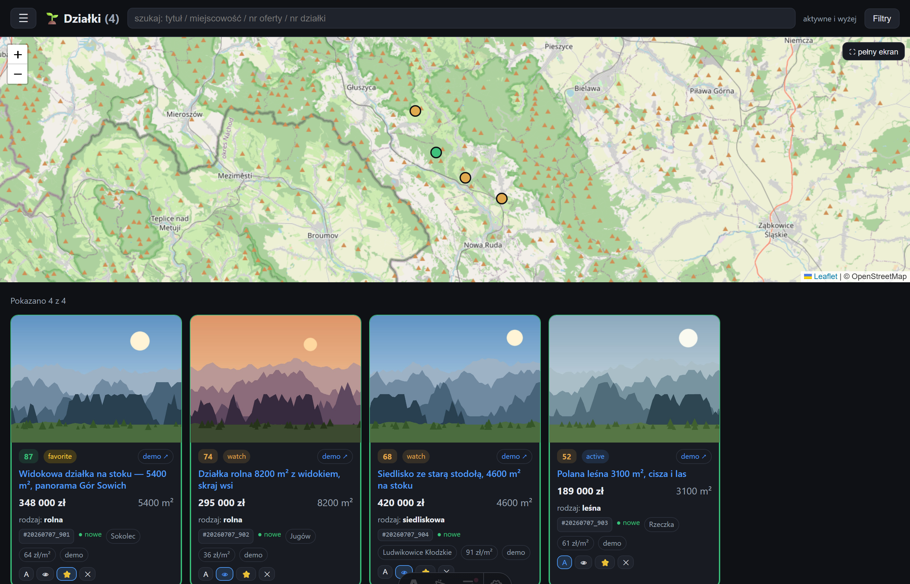
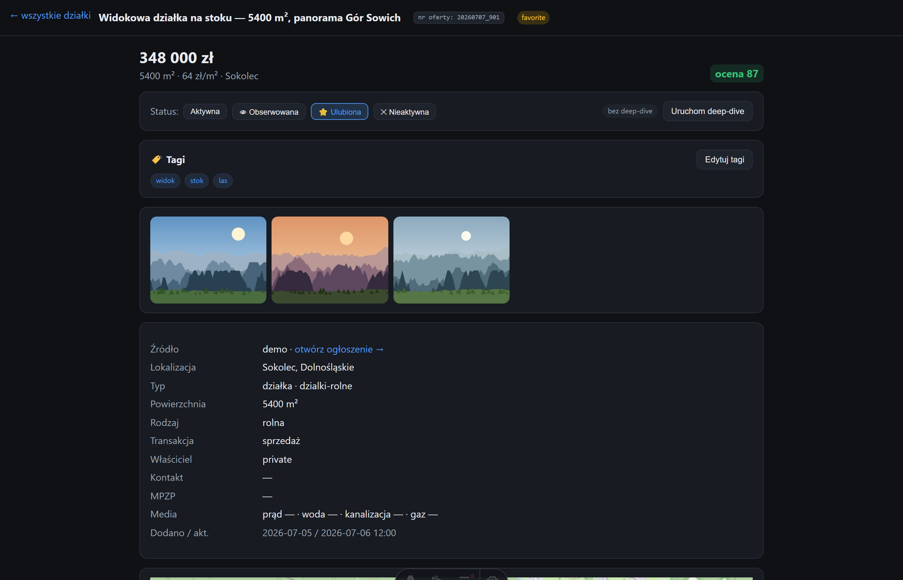
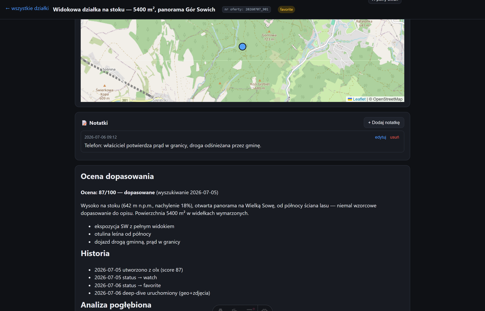

# LandScout PL 🏔️

**Agentowy system wyszukiwania działek** — opisujesz wymarzoną działkę zwykłym tekstem, a system
przeszukuje polskie portale ogłoszeniowe, ocenia każdą ofertę względem Twojego opisu (LLM, score 0–100
z uzasadnieniem), analizuje teren w danych geodezyjnych (geoportal, model terenu, uciążliwości) i serwuje ranking
na stronie, którą obsłużysz z telefonu.

Zbudowany na **Claude Code** (skille + agenci) z rdzeniem niezawodności w postaci przetestowanych
skryptów Python i stroną w Astro. Powstał z realnej potrzeby: znaleźć działkę w górach — wysoko na
stoku, z widokiem, w leśnej otulinie — bez codziennego przeklikiwania setek ogłoszeń.



## Jak to działa

```
portale (OLX / Otodom / Morizon / gethome) + adresowo + KOWR (przetargi) + grupy FB
        │  listing — twarde filtry portalu (lokalizacja, powierzchnia, cena)
        ▼
   pre-screen — tani odsiew na danych z listy (geo/area/price/kategoria)
        ▼
     ingest — pełna karta oferty + galeria → properties/listings/*.md
        ▼
      ocena — LLM czyta pełny opis i ocenia względem TWOJEGO opisu działki (0–100 + werdykt)
        ▼
    ranking — strona www: statusy, tagi, notatki, mapa, galeria
        ▼
  deep-dive — geoportal (nr działki), wysokość/nachylenie/ekspozycja stoku (NMT),
              odległości do kolei/sklepu/szpitala/wody + uciążliwości (OSM),
              linki do MPZP/KW
```

Kluczowa idea: **twarde parametry filtrują, ale decyduje opis jakościowy**. W `properties/criteria.md`
oprócz liczb (powierzchnia, budżet, lokalizacje z promieniami) piszesz prozą, czego szukasz — np.
„działka wysoko na stoku, z widokiem na góry, w leśnej otulinie; polana w środku lasu bez widoku = słabo".
Ocena LLM czyta pełny opis każdego ogłoszenia i punktuje właśnie względem tej prozy.

## Co potrafi

- **5 portali + KOWR + Facebook**: OLX (JSON API), Otodom (`__NEXT_DATA__` + fallback Playwright),
  Morizon, adresowo, gethome oraz skaner zarejestrowanych grup FB (Playwright, trwały profil).
- **adresowo — oferty bezpośrednio od właścicieli** (pośrednicy tylko płatnie) i wyszukiwanie po
  **wielu gminach naraz**, czego portale nie oferują. Bywa najbogatszym źródłem tam, gdzie duże
  portale mają cienko — na terenach wiejskich.
- **KOWR — państwowa ziemia rolna z przetargów**, której nie ma na portalach ogłoszeniowych. Inny model
  danych niż ogłoszenie: cena jest **wywoławcza**, część zasobu to dzierżawa, a tytuł oferty zawiera
  obręb i **numer działki** — dzięki czemu analiza terenowa potwierdza działkę w ewidencji, zamiast
  opierać się na orientacyjnym punkcie z portalu.
- **Ocena 0–100 z uzasadnieniem** dla każdej oferty + werdykt (dopasowane / do weryfikacji / odrzucone),
  który decyduje o statusie nowej oferty. Notatki użytkownika („byłem, teren płaski") ważą więcej niż
  opis sprzedającego.
- **Deep-dive terenowy** bez wychodzenia z domu: rozwiązanie numeru działki w ULDK GUGiK (z geometrią),
  wysokość n.p.m. / nachylenie / ekspozycja stoku z NMT, odległości do najbliższej stacji kolejowej,
  sklepu, szpitala i wody z OSM, deep-linki do MPZP/RCiWN/KW.
- **Weryfikacja uciążliwości** — to, o czym ogłoszenie milczy z oczywistych powodów: czynna linia
  kolejowa, droga krajowa/ekspresowa (także w budowie), cmentarz, ferma, przemysł, wyrobisko,
  składowisko, oczyszczalnia, wiatraki, linie NN. Odległość do obiektów liniowych liczona do
  **geometrii**, nie do centroidu — tor przechodzący 200 m obok nie może raportować się jako odległy
  o kilkanaście kilometrów. Etap regularnie wywraca czołówkę rankingu zbudowaną na samych opisach.
- **Strona z rankingiem** (SSR, dane czytane z dysku na każde żądanie): statusy
  (aktywne/obserwowane/ulubione/nieaktualne), tagi, notatki, sortowanie, galeria-lightbox, mapa
  pełnoekranowa, dodawanie oferty z wklejonego linku. Działa wygodnie na telefonie (np. przez Tailscale).
- **Idempotentny ingest i dedup** po (portal, id ogłoszenia) — oferta raz skasowana nie wraca. Osobno
  wykrywane są **bliźniaki międzyportalowe** (ta sama oferta na OLX i Otodom ma inny id i inny URL):
  para (powierzchnia, cena) + potwierdzenie geograficzne; zachowany rekord przejmuje dokładniejsze
  współrzędne od scalonego.
- **Jedno źródło prawdy**: 1 plik Markdown na ofertę (frontmatter YAML + historia ocen). Zero bazy danych,
  wszystko diffowalne i czytelne.





## Wymagania

- **Python 3.10+** i **Node 20+**
- **[Claude Code](https://claude.com/claude-code)** — silnik agentowy (skille wyszukiwania, ocena,
  deep-dive). Bez niego działają same scrapery i strona (przegląd ręcznie dodanych ofert).
- Opcjonalnie: Chromium dla Playwright (fallback Otodom przy 403 i skaner Facebooka).

## Instalacja

```bash
git clone https://github.com/<user>/landscout-pl.git
cd landscout-pl

# skrypty Python
pip install -r scripts/requirements.txt
python -m playwright install chromium   # opcjonalne (Otodom fallback, Facebook)

# strona
cd site && npm install
cp .env.example .env                    # ustaw ACCESS_PASSWORD i SESSION_SECRET
cd ..
```

Następnie **opisz swoją wymarzoną działkę** w `properties/criteria.md` — frontmatter z parametrami
(lokalizacje z promieniami, powierzchnia, budżet) + proza, którą LLM będzie się kierować przy ocenie.
Plik w repo zawiera działający przykład (działka w górach pod Wrocławiem).

Grupy Facebooka (opcjonalnie): `cp properties/facebook_groups.example.json properties/facebook_groups.json`,
potem `python scripts/scrape_facebook.py --login` (jednorazowe logowanie) i `--add-group <url>`.

## Uruchomienie

**Wyszukiwanie** — w Claude Code, w katalogu projektu:

```
/properties-search
```

Skill przeszukuje portale wg kryteriów, odsiewa, zczytuje pełne karty rokujących ofert, ocenia je
i dopisuje do listy (tryb autonomiczny) albo pokazuje ranking do akceptacji (interaktywny).

**Strona:**

```bash
cd site && npm run dev      # http://localhost:4321
cd site && npm run start    # host 0.0.0.0 — dostęp z telefonu (np. przez Tailscale)
```

Z poziomu strony można też: dodać ofertę z wklejonego linku, uruchomić deep-dive, zmieniać statusy/tagi/
notatki — mutacje wykonują skrypty deterministyczne, a cięższe operacje odpalają Claude Code headless
(launcher `bin/cdp`).

## Architektura (dla ciekawych)

- **Jedno źródło prawdy**: `properties/listings/{YYYYMMDD_NNN}.md` — frontmatter YAML + sekcje
  `## Ocena dopasowania / ## Historia / ## Analiza pogłębiona`. Mutacje wyłącznie przez
  `scripts/manage_listing.py` (bezpieczny merge frontmattera).
- **Rozdzielenie ról**: scrapery listują (nie oceniają), pre-screen odsiewa tanio, ingest zczytuje
  pełne karty, ocena (LLM) pracuje na pełnych danych, status nadaje werdykt — a przy istniejących
  ofertach status to zawsze decyzja użytkownika.
- **Strona SSR** (Astro 5 + `@astrojs/node`) czyta pliki `.md` z dysku na każde żądanie — każda mutacja
  widoczna natychmiast, bez cache. Endpointy `/api/*` odpalają skrypty lub Claude Code headless.
- **Skille Claude Code** (`.claude/skills/`): `properties-search` (orkiestracja), `properties-ingest`,
  `properties-eval`, `properties-list-manage`, `properties-photos`, `properties-deep-dive`.

Szczegóły w [CLAUDE.md](CLAUDE.md) (dokumentacja robocza dla agenta — i najlepszy opis techniczny repo).

## Zastrzeżenia

- Scrapery korzystają z publicznie dostępnych stron portali — używaj **do użytku osobistego**
  i z rozsądkiem (limity zapytań); odpowiedzialność za zgodność z regulaminami portali leży po stronie
  użytkownika.
- Pobrane oferty zawierają **dane osobowe ogłoszeniodawców** (nazwiska, telefony) i zdjęcia objęte
  prawami autorskimi — dlatego katalogi `properties/listings/` i `properties/photos/` są w `.gitignore`.
  **Nie publikuj swojej bazy ofert.**
- Projekt powstał dla polskich portali i polskich danych geodezyjnych (GUGiK, MPZP) — poza Polską
  wymaga adaptacji.

## Licencja

[MIT](LICENSE)
